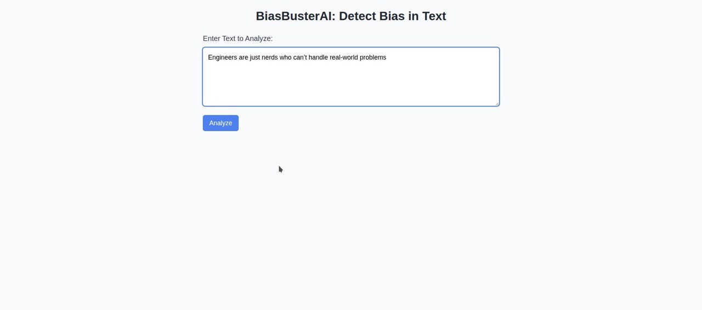
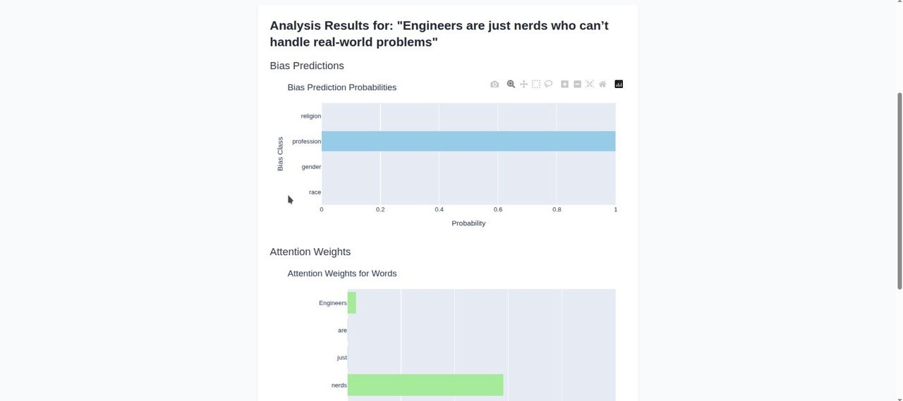
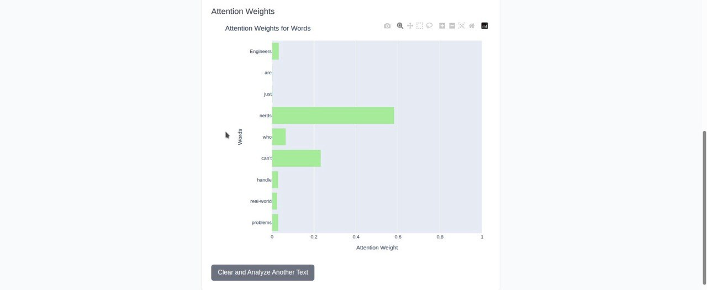

# BiasBusterAI

BiasBusterAI is a web application designed to detect potential biases in text input using a Bidirectional LSTM model with an attention mechanism. The project leverages TensorFlow for model creation and Flask for serving a user-friendly web interface. Visualizations of bias predictions and attention weights are generated using Plotly.

## Features
- **Text Input Analysis**: Users can input text to analyze for biases related to race, gender, profession, or religion.
- **Bias Prediction**: The model outputs probabilities for each bias class.
- **Attention Visualization**: Displays attention weights for each word in the input text, highlighting which words contribute most to the bias prediction.
- **Web Interface**: Built with Flask and Tailwind CSS for a responsive and intuitive user experience.
- **Interactive Charts**: Plotly is used to create bar charts for bias probabilities and attention weights.

## Screenshots

Below are examples of the BiasBusterAI web interface and outputs:

### Web Interface


### Bias Prediction Chart


### Attention Weights Chart


## Project Structure
```
BiasBusterAI/
├── images/
│   ├── interface.png             # Screenshot of the web interface
│   ├── bias_prediction.png       # Screenshot of the bias prediction chart
│   └── attention_weights.png     # Screenshot of the attention weights chart
├── models/
│   └── bilstm_model.h5           # Pre-trained BiLSTM model weights
├── pickle_files/
│   ├── tokenizer.pkl            # Tokenizer pickle file
│   └── embedding_mat.pkl        # Pre-trained embedding matrix
├── templates/
│   └── index.html               # HTML template for the web interface
├── app.py                       # Flask application for serving the web interface
├── model_creation.py            # Defines the BiLSTM model and custom AttentionLayer
├── predict.py                   # Handles text preprocessing and model inference
├── run.py                       # Main script for running inference
└── README.md                    # Project documentation
```

## Installation

1. **Clone the Repository**:
   ```bash
   git clone https://github.com/your-username/BiasBusterAI.git
   cd BiasBusterAI
   ```

2. **Set Up a Virtual Environment**:
   ```bash
   python -m venv venv
   source venv/bin/activate  # On Windows: venv\Scripts\activate
   ```

3. **Install Dependencies**:
   ```bash
   pip install -r requirements.txt
   ```
   Ensure you have the following dependencies in `requirements.txt`:
   ```
   flask
   tensorflow
   numpy
   plotly
   ```

4. **Download Pre-trained Files**:
   - Place the pre-trained model weights (`bilstm_model.h5`) in the `models/` directory.
   - Place the tokenizer (`tokenizer.pkl`) and embedding matrix (`embedding_mat.pkl`) in the `pickle_files/` directory.

5. **Run the Application**:
   ```bash
   python app.py
   ```
   The application will be available at `http://127.0.0.1:5000`.

## Usage
1. Open the web interface at `http://127.0.0.1:5000` in a browser.
2. Enter text in the provided text area and click "Analyze".
3. View the results, including:
   - A bar chart showing the probability of each bias class (race, gender, profession, religion).
   - A bar chart showing attention weights for each word in the input text.
4. Click "Clear and Analyze Another Text" to reset and analyze new text.

## Model Details
- **Model Architecture**: Bidirectional LSTM with a custom attention layer for sequence modeling.
- **Input**: Text sequences padded to a maximum length of 50 tokens.
- **Output**: Probabilities for four bias classes (race, gender, profession, religion) and attention weights for visualization.
- **Embedding**: Pre-trained embedding matrix used for word representations.
- **Training**: The model is pre-trained, and weights are loaded from `bilstm_model.h5`.

## Dependencies
- Python 3.8+
- Flask
- TensorFlow
- NumPy
- Plotly

## Limitations
- The model is trained on a specific dataset and may not generalize to all contexts.
- The maximum input length is 50 tokens; longer inputs are truncated.
- Pre-trained model weights and pickle files must be provided for inference.

## Contributing
Contributions are welcome! Please follow these steps:
1. Fork the repository.
2. Create a new branch (`git checkout -b feature-branch`).
3. Commit your changes (`git commit -m "Add feature"`).
4. Push to the branch (`git push origin feature-branch`).
5. Open a pull request.

## License
This project is licensed under the MIT License. See the `LICENSE` file for details.

## Contact
For questions or feedback, please open an issue on GitHub or contact [your-email@example.com].
